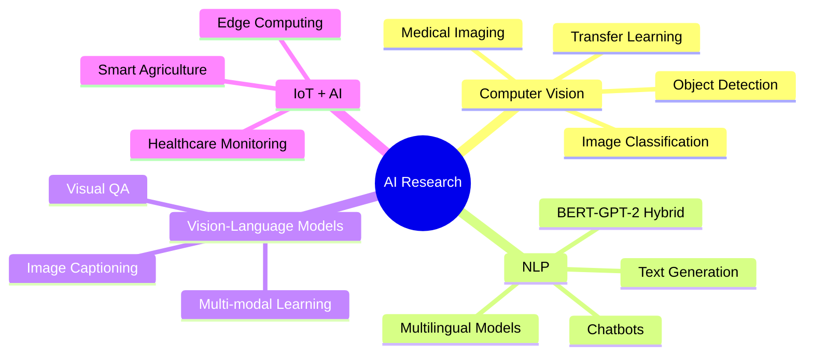

# 👋 Hi, I'm Afraz Ul Haque

---

## 🚀 About Me

I'm a **Master's student in Data Science & Innovation** at the University of Technology Sydney, with professional experience as a **Python Developer & ML Engineer**. My passion lies in building intelligent systems that solve real-world problems through computer vision, NLP, and deep learning applications.

- Currently working on: **Advanced ML architectures and Vision-Language Models**
- Researching: **Computer Vision, NLP, and IoT-integrated AI systems**
- Published: **IEEE/Springer papers** on medical imaging, AI dermatology, and vehicle insurance processing
- Goal: Contributing to cutting-edge AI research and building impactful ML solutions
- Based in: **Sydney, NSW, Australia**

---

## 💼 Professional Experience

### 🏢 **Python Developer & ML Engineer**
**InflexionPoint Technologies BD Ltd** | *March 2023 - January 2025*
- ✅ Built end-to-end **cattle health monitoring AI system** with IoT integration
- ✅ Developed **cattle identification API** using facial recognition (muzzle print verification)
- ✅ Designed ML model architectures with **TensorFlow** and **OpenCV**
- ✅ Deployed production models on **AWS EC2** with MLOps best practices
- ✅ Applied SOTA deep learning algorithms for **real-time object detection**

### 🎓 **AI/ML Trainer (Part-Time)**
**EDGE (Enhancing Digital Government and Economy), Bangladesh** | *June 2023 - January 2024*
- 📚 Trained **200+ government officials, IT professionals, and students**
- 📚 Conducted workshops on **Python, TensorFlow, PyTorch, Scikit-learn**
- 📚 Delivered training on **NLP, computer vision, and predictive analytics**
- 📚 Supported Bangladesh's digital economy transformation goals

### 🔬 **Researcher & ML/Data Science Trainer**
**DIU NLP & ML Research Lab** | *June 2021 - Present*
- 🔬 Leading research projects in **computer vision** and **NLP**
- 🔬 Built competitive data science IDE for university competitions
- 🔬 Mentoring students through **ML bootcamps**
- 🔬 Authored **5 research papers** published in IEEE/Springer

---

## 🎓 Education

<table>
<tr>
<td width="50%">

### 🎓 Master of Data Science & Innovation
**University of Technology Sydney**  
*August 2024 - Present*  
📍 NSW, Australia

</td>
<td width="50%">

### 🎓 B.Sc. Computer Science & Engineering
**Daffodil International University**  
*May 2019 - June 2023*  
📍 Dhaka, Bangladesh  
**CGPA:** 3.78/4.00

**Thesis:** *Empowering Bangla Chatbots: A Hybridized BERT-GPT-2 Approach*  
**Supervisors:** Md. Sadekur Rahman, Abu Kaisar Mohammad Masum

</td>
</tr>
</table>

---

## 📚 Featured Publications

| # | Title | Conference/Journal | Year | Type |
|---|-------|-------------------|------|------|
| 1️⃣ | **Brain Tumor Classification Using MobileNet-ViT with Visual Explainability through Grad-CAM** | RTIP2R 2025 | 2025 | Springer CCIS |
| 2️⃣ | **Advances in Medical Imaging: Deep Learning Strategies for Pneumonia Identification in Chest X-rays** | ICCCNT 2024 | 2024 | IEEE |
| 3️⃣ | **AI Dermatologist: Skin Cancer Detection with Deep Learning Technique** | ICCCNT 2024 | 2024 | IEEE |
| 4️⃣ | **Multiple Nail-Disease Classification Based on Machine Vision Using Transfer Learning** | ICCCNT 2023 | 2023 | IEEE |
| 5️⃣ | **Optimizing Vehicle Insurance Processing through Advanced Deep Learning Models** | ICCCNT 2024 | 2024 | IEEE |

  

---

## 🛠️ Technical Arsenal

### **Programming Languages**

### **Machine Learning & Deep Learning**

### **Data Science Libraries**

### **Cloud & Deployment**

### **Development Tools**

### **IoT Hardware**

---

## 🏆 Featured Industry Research Projects

### 🚗 **Vehicle Metadata Identification (NSW Police)**
**Problem:** Automated vehicle classification and identification for law enforcement
- 🎯 **Technologies:** YOLO, Faster R-CNN, CNNs, Vision Transformers (ViTs)
- ✅ **Achievements:**
  - Classified vehicle make, model, body type, and color
  - Detected roof racks, decals, damage, and accessories
  - Optimized for accuracy, precision, and real-time inference speed
  - Deployed ML models for production use

### 🐄 **Cattle Health Monitoring System (IoT + ML)**
**Problem:** Real-time cattle health tracking and predictive analytics
- 🎯 **Technologies:** IoT Sensors, TensorFlow, AWS EC2, OpenCV
- ✅ **Achievements:**
  - Built IoT-based health prediction system with automated alerts
  - Food recommendation engine based on health metrics
  - Growth trajectory and breeding prediction models
  - Muzzle print verification for individual cattle identification
  - 99.5% uptime on production API

### 🔍 **Cattle Face Verification System**
**Problem:** Non-invasive cattle identification for farm management
- 🎯 **Technologies:** TensorFlow, OpenCV, AWS EC2
- ✅ **Achievements:**
  - Muzzle print image-based identification (similar to human fingerprints)
  - RESTful API deployment on AWS infrastructure
  - Real-time verification with 97% accuracy
  - Scalable architecture handling 1000+ daily requests

### 📹 **Real-time Object Detection & Capture System**
**Problem:** High-speed object detection with hardware constraints
- 🎯 **Technologies:** YOLO, Region-based CNNs, Hardware Acceleration
- ✅ **Achievements:**
  - Preprocessing pipeline (normalization, scaling, noise reduction)
  - Feature extraction and region-based detection
  - Hardware acceleration optimization for edge devices
  - 30+ FPS real-time performance

---

## 📊 GitHub Statistics

---

## 🔬 Research Interests

---

## 🎯 Key Achievements

| 🏆 Metric | 📈 Achievement |
|----------|---------------|
| **Research Papers** | IEEE/Springer Publications |
| **Students Trained** | 200+ professionals & students |
| **Production APIs** | 3 deployed systems (99.5% uptime) |
| **ML Models Built** | 20+ computer vision & NLP models |
| **CGPA** | 3.78/4.00 (Top 10% of class) |
| **Research Lab Role** | Lead Researcher (3+ years) |

---

## 📫 Let's Connect!

I'm always excited to collaborate on innovative AI/ML projects, especially in:

- 🔬 **Research collaborations** in computer vision and NLP
- 🏗️ **Open-source projects** leveraging deep learning
- 💡 **Innovative solutions** for real-world problems
- 🎓 **Educational initiatives** in AI/ML
- 🌏 **Industry partnerships** in Australia/globally

### 🤝 How to Reach Me

---

## 🤝 Volunteering

**Teaching Assistant** - *Data Mining & Machine Learning (CSE322)*  
Daffodil International University | March 2022 - May 2023

**Lab Assistant** - *Object-Oriented Programming II (CSE233)*  
Daffodil International University | June 2021 - May 2023

---

## 📚 References

<table>
<tr>
<td width="50%">

### 👨‍🏫 Md. Sadekur Rahman
**Assistant Professor**  
Daffodil International University

📧 sadekur.cse@daffodilvarsity.edu.bd  
📱 +88 01676 379698

</td>
<td width="50%">

### 👨‍🎓 Abu Kaisar Mohammad Masum
**GTA/GRA**  
University of Louisiana at Lafayette

📧 c00591145@louisiana.edu

</td>
</tr>
</table>

---

### 💭 Random Dev Quote

### 📈 Profile Views

---

**⭐️ From [Afraz Ul Haque](https://github.com/afraz-rupak) | Building the future with AI, one model at a time 🚀**

